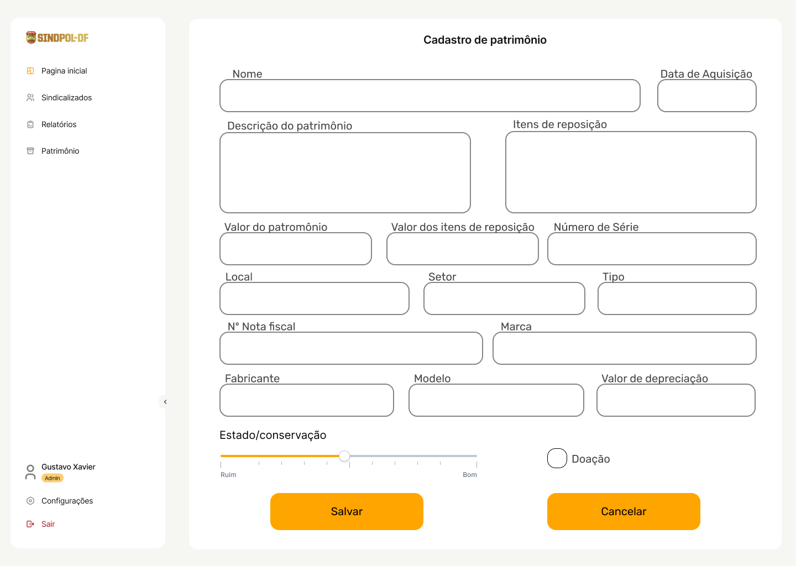

## 1. Introdução

O protótipo de alta fidelidade é uma ferramenta essencial no processo de desenvolvimento de um projeto de software, que desempenha um papel crucial na transformação de conceitos e ideias em uma representação visual concreta e funcional da futura aplicação. 

Um protótipo de alta fidelidade é, de fato, a representação mais próxima possível do produto final. Ele vai muito além de simples esboços ou wireframes, incorporando elementos gráficos, layouts detalhados, interações de usuário e até mesmo funcionalidades específicas. Essa riqueza de detalhes permite que os desenvolvedores e stakeholders tenham uma visão clara e tangível do que a aplicação será no final do processo de desenvolvimento.

Tendo em vista esse conceito foi preparado várias telas que correspondem às funcionalidades da aplicação. Sendo passíveis de alterações e mudanças os protótipos são uma importante ferramenta para incorporação de valor para o cliente.

## 2. Telas 

O processo de prototipação foi feito com base no guia de estilo sendo esse uma parte fundamental para padronização das páginas fornecendo diretrizes específicas de design, estrutura e elementos visuais. Isso assegura que todas as telas e funcionalidades da aplicação sigam um conjunto de regras e estilos coesos, garantindo uma experiência consistente e profissional para os usuários finais.

Além disso, ao seguir o guia de estilo, a equipe de desenvolvimento pode trabalhar de forma mais eficiente, economizando tempo e esforço na criação e manutenção das telas, uma vez que as diretrizes já foram estabelecidas. Isso resulta em um produto mais consistente e de alta qualidade, atendendo às expectativas do SINDPOL e proporcionando uma experiência superior para os usuários.

Para saber mais sobre as diretrizes de estilo, consulte o [Guia de estilo](guia.md).

Para acessar o protótipo de alta fidelidade navegável [clique aqui](https://www.figma.com/proto/8gIW1AmAtSPj6XSkKPHvA1/Protótipo-de-Alta-Fidelidade?type=design&node-id=49-2307&t=tSbJMQK0Fv3tphFH-1&scaling=min-zoom&page-id=0%3A1&starting-point-node-id=49%3A2307&show-proto-sidebar=1).

### 2.1 Login 

### 2.2 Formulário de filiação

### 2.3 Recuperação de senha

**Após o envio do e-mail de recuperação de senha**

### 2.4 Dashboard de sindicalizado

### 2.5 Gerar documentos

**Selecionado**

### 2.6 Importar sindicalizados

**Processando**

### 2.7 Dashboard Gestor

### 2.8 Listar sindicalizados

### 2.9 Aceitar sindicalizado

### 2.10 Cadastrar sindicalizado

### 2.11 Cadastrar Pensionista 

### 2.12 Listar patrimônios

### 2.13 Cadastrar patrimônio

### 2.14 Cadastrar patrimônio doação

### 2.15 Visualizar/editar patrimônio

### 2.16 Listar relatórios

### 2.17 Emitir relatório

### 2.18 Formulário de desfiliação

## 3. Histórico de Revisão

| Data       | Versão |      Modificação      |    Autor     |
| :--------- | :----- | :-------------------- | :----------- |
|19/10/2023| 0.1 | Criação do documento | Mateus Moreira  |
|11/12/2023| 1.0 | Atalização dos protótipos | Carlos Eduardo  |
