## Lean inception 
A Lean Inception é uma abordagem colaborativa e enxuta (lean) que visa definir o escopo, os objetivos e os requisitos de um projeto de forma eficiente e eficaz. Ela se destina a criar um entendimento compartilhado entre a equipe de desenvolvimento, partes interessadas e outros envolvidos, antes de iniciar um projeto, seja ele de desenvolvimento de software, produto ou qualquer iniciativa. Concebida por Paulo Caroli, essa abordagem visa alcançar o Minimum Viable Product (MVP), ou Produto Mínimo Viável.

*MVP* 

O MVP (Produto Mínimo Viável) é uma versão simplificada de um produto ou serviço que contém apenas as funcionalidades essenciais necessárias para validar sua viabilidade no mercado e obter feedback dos usuários. O objetivo do MVP é testar hipóteses, minimizar custos e tempo de desenvolvimento, e iterar com base nas respostas dos clientes antes de investir em uma versão completa do produto.

O funcionamento do Lean Inception se baseia em atividades estruturadas, cada uma com um papel específico no processo de definição e refinamento do MVP.

Estas são : 

- Visão do produto

- É/NÃO É/FAZ/NÃO FAZ

- Esclarecimento do objetivo

- Personas

- Jornadas do Usuário

- Brainstorming de Funcionalidades

- Revisão Técnica, de Negócio e de UX

- Sequenciador

- MVP Canvas 

## Visão de produto
 
A visão de produto em um Lean Inception é uma declaração clara e concisa que descreve a visão geral do que o produto ou projeto almeja alcançar. Ela proporciona um entendimento compartilhado entre a equipe de desenvolvimento, partes interessadas e demais envolvidos sobre os objetivos, propósito e direção do projeto. A visão de produto responde às perguntas fundamentais, como por que o projeto está sendo iniciado, quais problemas ele pretende resolver e qual é o valor que ele entregará aos usuários ou clientes. Essa declaração serve como um ponto de partida crucial durante o processo de Lean Inception, ajudando a garantir que todos estejam alinhados com a missão do projeto desde o início.

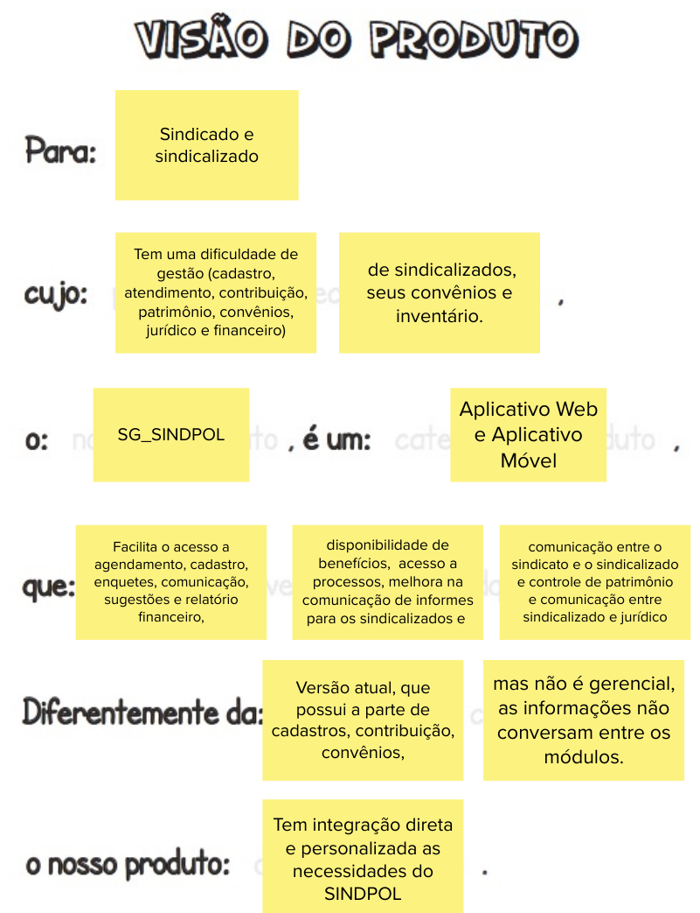

## É - Não É - Faz - Não Faz
É, Não é, Faz e Não Faz - desempenham um papel fundamental na definição de projetos. "É" define o que é essencial, "Não é" estabelece limites claros, "Faz" descreve como as metas serão alcançadas, e "Não Faz" ajuda a evitar distrações. Essas palavras simplificam a comunicação e alinham as equipes, contribuindo para a criação de produtos mais eficazes e alinhados com as necessidades dos usuários.
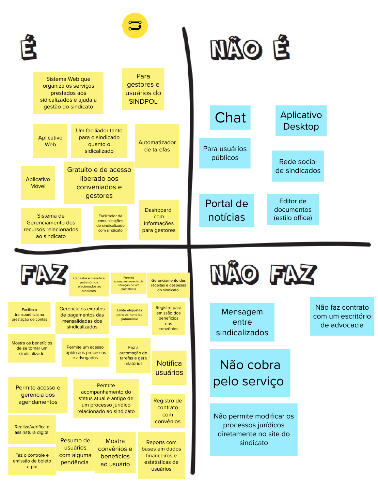

## Personas

Nessa atividade, a ideia é conhecer muito bem as pessoas que vão usar o produto e entender o que elas querem. Para isso, criamos personas, que são como personagens fictícios que representam essas pessoas. Isso ajuda a construir o produto de forma que ele seja útil e atenda às necessidades das pessoas que vão usá-lo.
### Personas 1
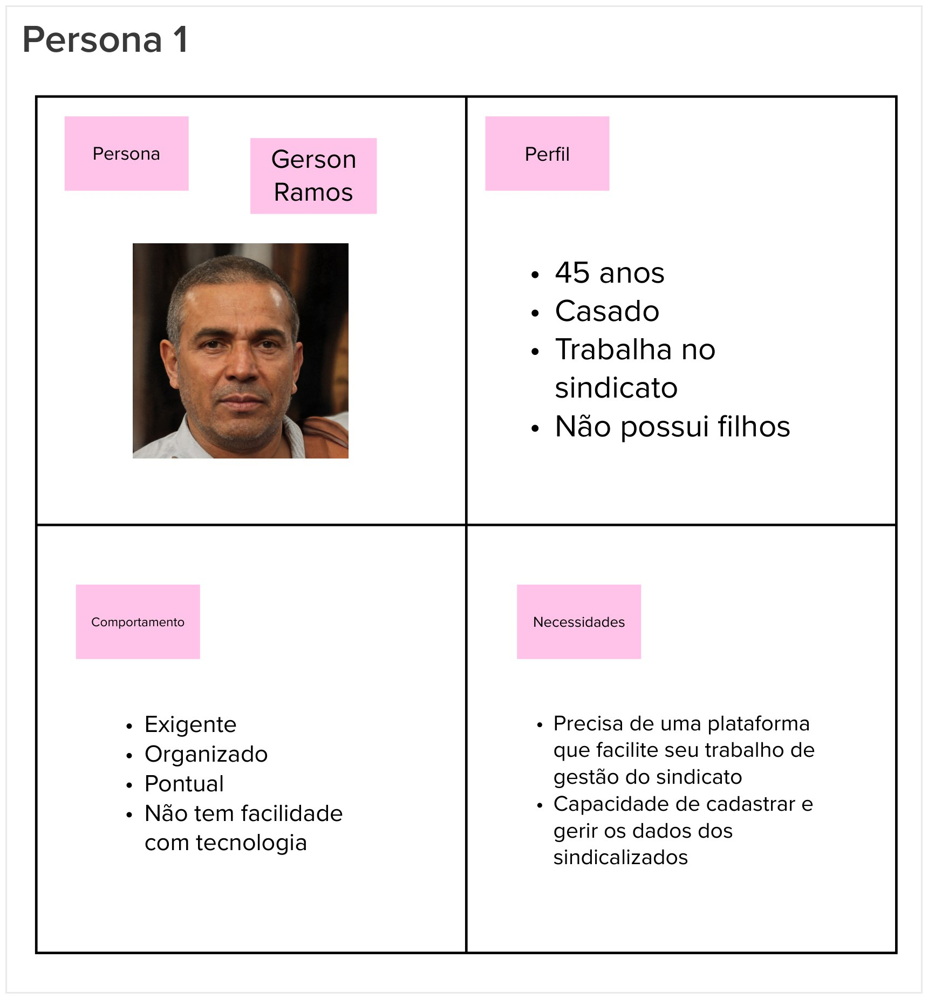
### Personas 2
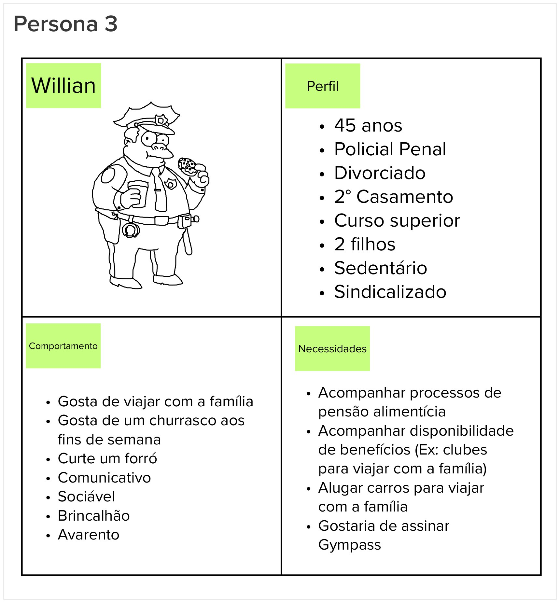
### Personas 3
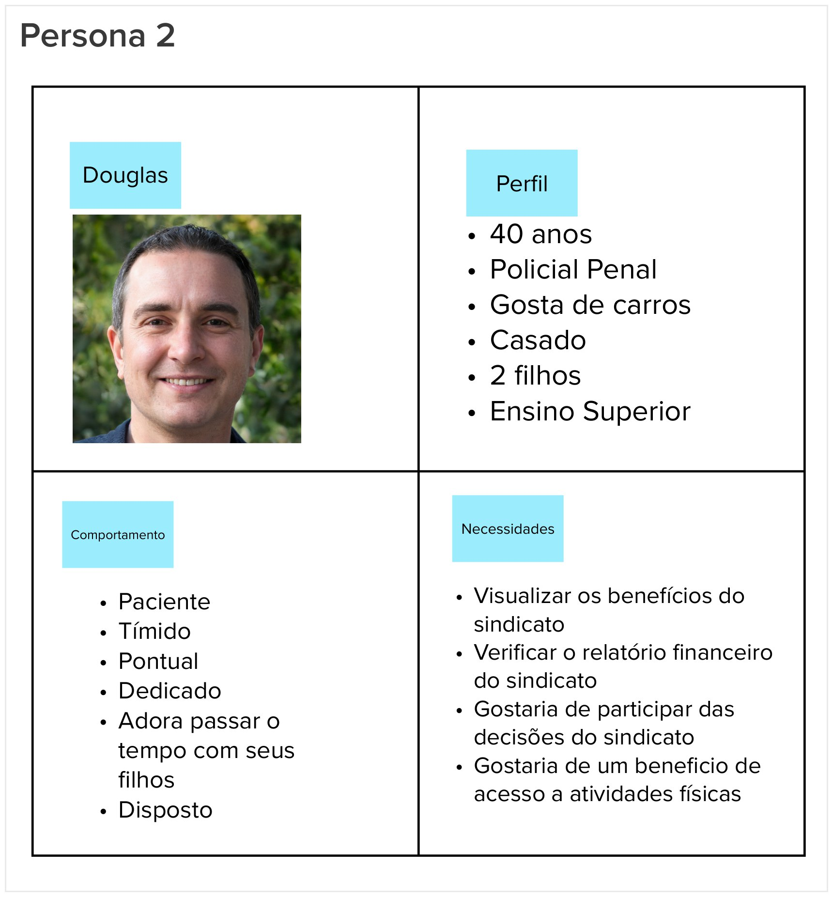

## Jornadas do usuário

A Jornada do Usuário envolve o mapeamento das etapas que uma persona segue ao interagir com um produto, desde o primeiro contato até a realização de suas tarefas. Isso ajuda a equipe a identificar os pontos de contato do usuário com o produto, suas emoções, necessidades e possíveis problemas.

À medida que construímos a jornada, a equipe levanta questões sobre as necessidades do usuário e as funcionalidades do produto, permitindo melhorias ao longo do processo.

Nossa equipe realizou 3 diferentes jornadas:

### Jornada 1
Rerente a um sindicalizado acompanhando/solicitando um benefício.

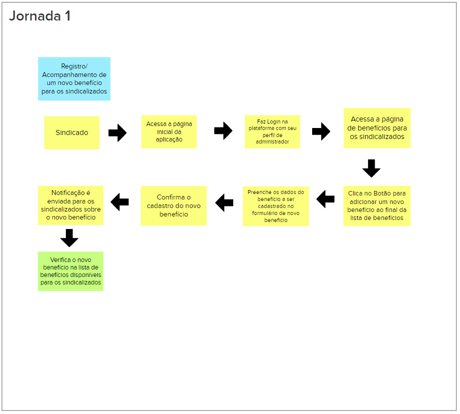

### Jornada 2
Um sindicalizado faz um agendamento na aplicação.

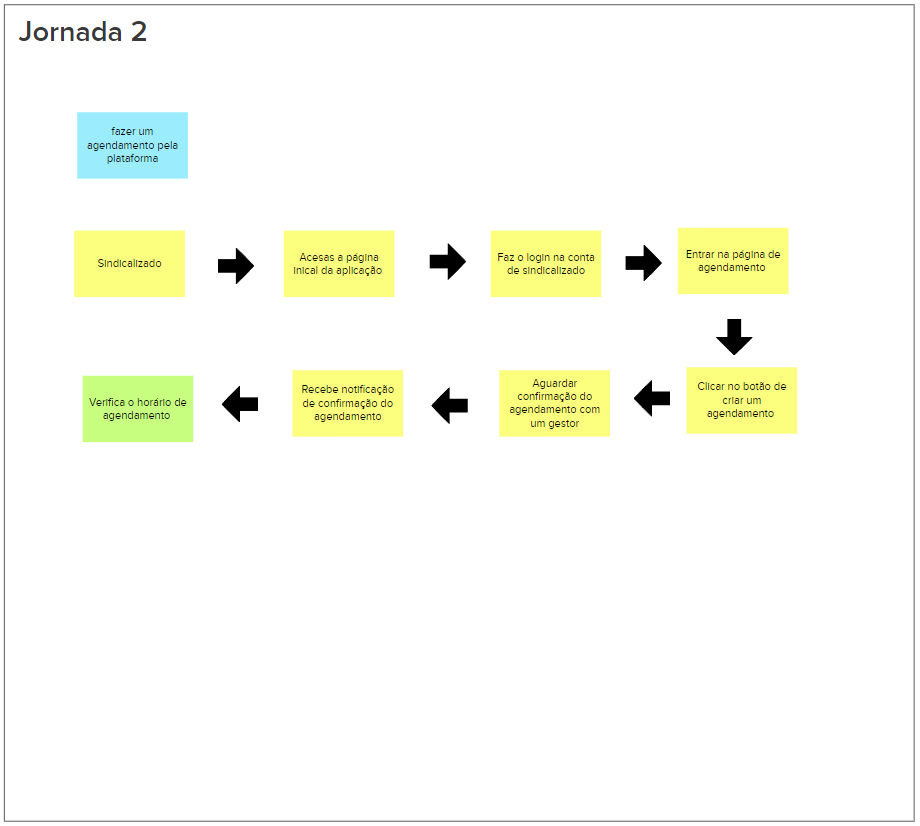

### Jornada 3
Referencia um sindicalizado desejando pagar um boleto e verificando seu status na aplicação.

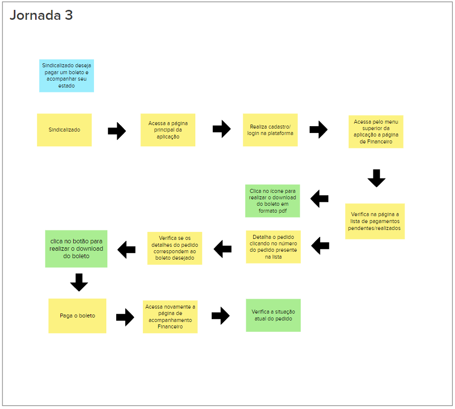

## Brainstorm de funcionalidades

O brainstorm de funcionalidades é um processo colaborativo no desenvolvimento de produtos ou projetos que envolve a geração de ideias para novas características ou melhorias em um produto. Durante uma sessão de brainstorm, a equipe reúne-se para gerar o maior número possível de ideias relacionadas às funcionalidades do produto. Essas ideias podem ser diversas e variar em complexidade.

Em resumo, o brainstorm de funcionalidades é uma prática valiosa que impulsiona a inovação, promove o engajamento da equipe e ajuda na tomada de decisões estratégicas.

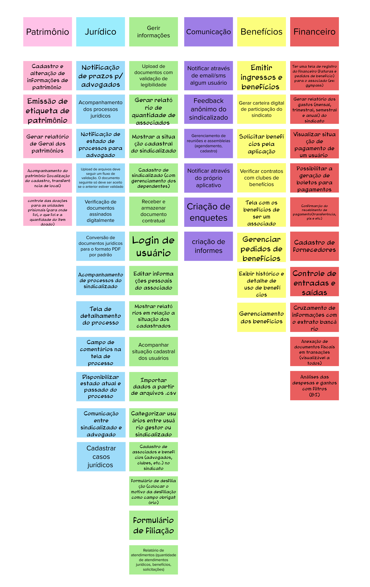

## Revisão Técnica, de Negócio e de UX

No desenvolvimento do produto e nessa etapa do lean inception de revisão técnica são utilizados métodos de estimativas para categorizar esforço, valor de négocio e valor de experiência de usuário.

Essas três revisões, técnicas, de negócios e de UX, são vitais para garantir que o produto seja bem-sucedido, seja tecnicamente sólido, financeiramente viável e proporcione uma excelente experiência aos usuários.

### Gráfico de semáforo

Esse gráfico recebe o nome “gráfico do semáforo”, pois as suas
cores são as mesmas de um semáforo: verde, pode ir tranquilo;
amarelo, preste atenção, talvez tenha de parar antes de prosseguir;
vermelho, pare e espere antes de prosseguir.

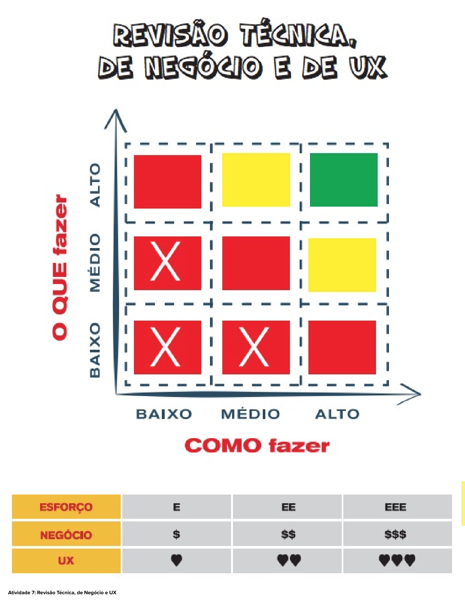

Basicamente esse gráfico é uma forma de se estimar que uma funcionalidade pode ser tecnicamente viável ou não em próximas etapas do Lean Inception.

### Cards da Revisão Técnica, de Negócio e de UX

Com a ajuda do gráfico de semáforos a equipe pode categorizar as funcionalidades em **como fazer**, **o que fazer** e estimar **esforço EE**, **valor de negócio $$** e **experiência de usuário <3 <3**

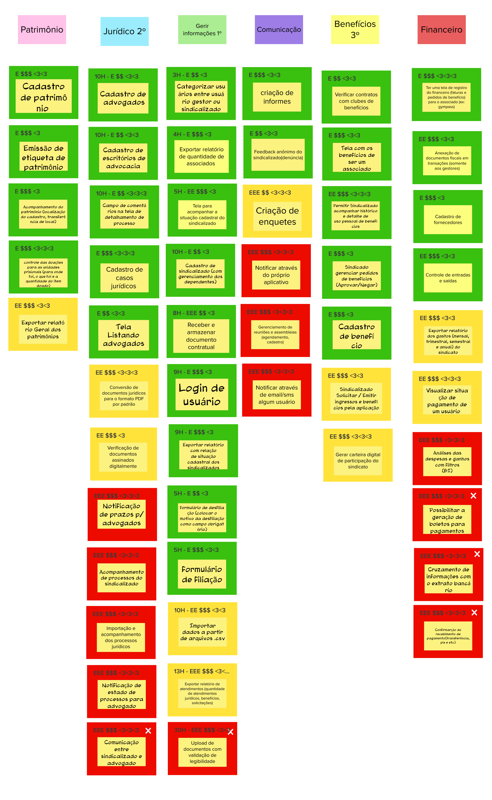

## Sequenciador
O Sequenciador de Funcionalidades é uma ferramenta essencial para organizar e priorizar as funcionalidades de um projeto. Ele ajuda as equipes a definir a ordem de desenvolvimento e validação das funcionalidades, permitindo que o produto seja construído de maneira incremental, com foco nas funcionalidades mais importantes e na entrega de valor aos usuários. Essa abordagem flexível e adaptativa é fundamental em metodologias ágeis, como o Scrum, para garantir o sucesso do projeto.

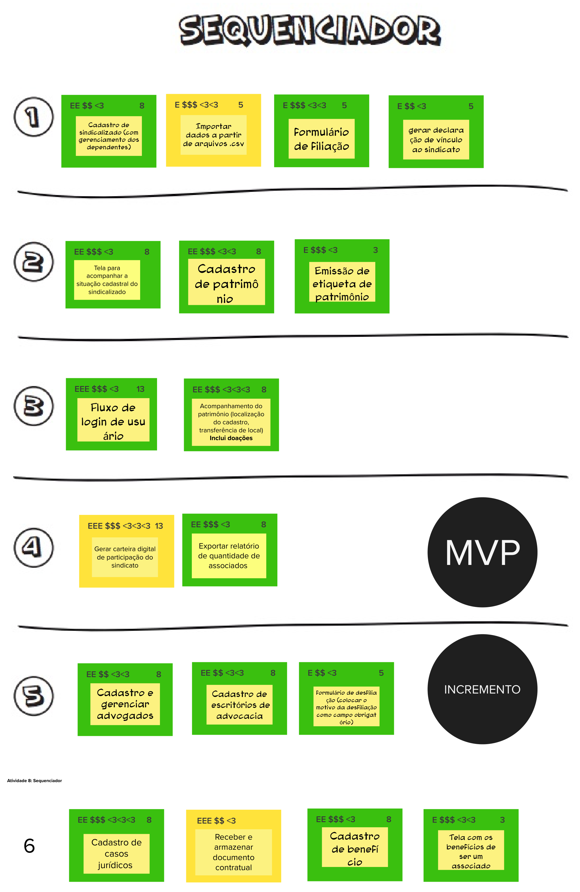

## Canvas MVP

O MVP Canvas, ou "Minimum Viable Product Canvas," é uma ferramenta visual que ajuda as equipes a planejar e conceitualizar um Produto Mínimo Viável (MVP). Um MVP é uma versão inicial simplificada de um produto ou serviço, criada para testar hipóteses e validar ideias com o mínimo esforço e recursos.

O MVP Canvas é semelhante a um quadro ou modelo que consiste em diferentes seções, cada uma delas abordando aspectos essenciais do MVP. 

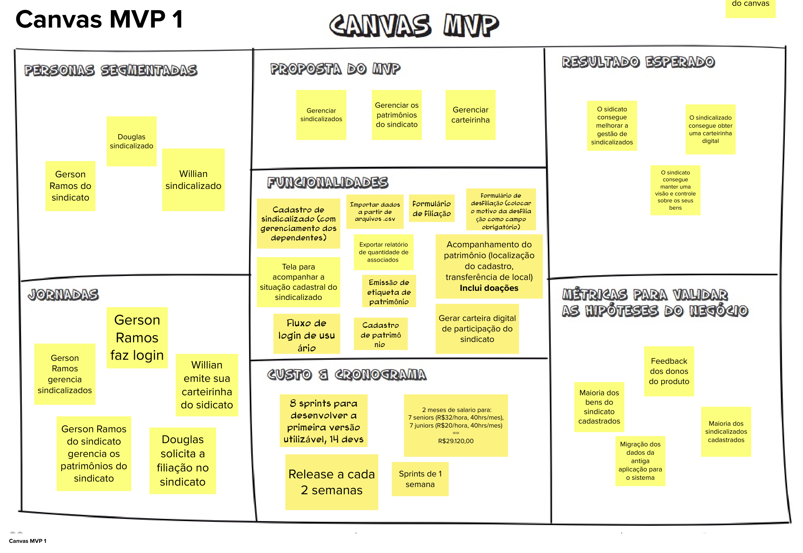

## Referências Bibliográficas

CAROLI, P. **Lean Inception: como alinhar pessoas e construir o produto certo**. 1a. ed. São Paulo: Editora Caroli, 2018.

## 5. Histórico de Revisão

| Data       | Versão |      Modificação      |    Autor     |
| :--------- | :----- | :-------------------- | :----------- |
|19/10/2023| 0.1 | Criação do documento | Mateus Moreira   Alexandre Lema   Carlos Eduardo |