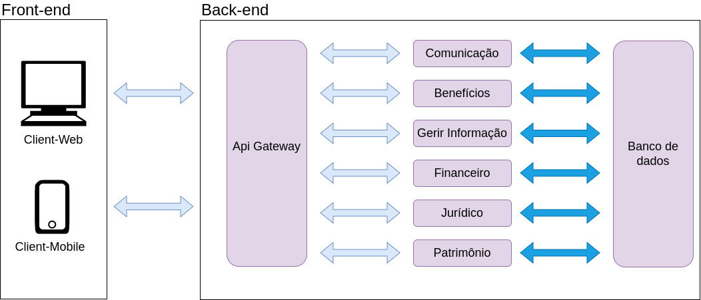
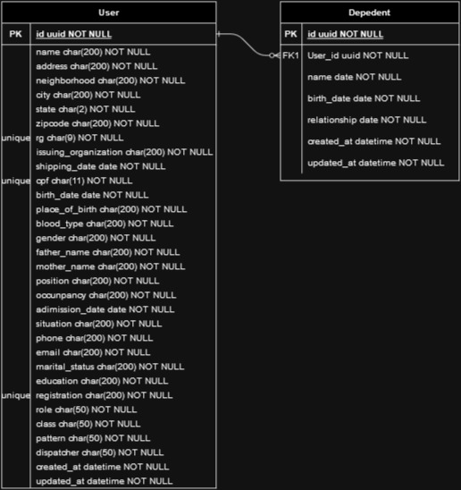

# Documento de Arquitetura

## 1. Introdução

Este Documento de Arquitetura de Software tem como objetivo fornecer uma descrição detalhada dos principais aspectos arquiteturais da solução de software do projeto SINDPOL. Ele documenta informações e decisões relevantes relacionadas à arquitetura do projeto ao longo de seu desenvolvimento.

O SG_SINDPOL é um sistema desenvolvido para auxiliar as diversas atividades de gestão que o SINDPOL. Seu objetivo é fornercer uma ferramenta que resolva os problemas de gestão do sindicato, assim como ambito do jurídico.

## 2. Relações 

### 2.1. Visão Geral da Arquitetura 

Para esse sistema, pensamos em uma solução baseada em microserviços, onde cada cluster do projeto será um desses microserviços. Para Front-end do sistema optamos por fazer dois clients, um web e um mobile, que fará a comuinicação com os microserviços do sistema através de uma gateway. Os microserviços do sistema são os: comunicação, benefícios, gerir informações, financeiro, jurídico e de patrimônio, como podemos ver no diagrama abaixo: 

## 3. Serviços 
### 3.1. Frontend 
O Front End é a Interface de comunicação entre o Usuário e o Sistema.

### 3.2. Api Gateway 

O Api Gateway é utilizado como um _mutex_ para a comunicação entre a interface de usuário e os outros micro-serviços. Dessa forma, ao receber uma requisição o gateway atua como uma ponte entre o front end e o serviço desejado. Atualmente, esse serviço é responsável por fazer o tratamento das requisições entre os microsserviços de comunicação, benefício, gerir informações, financeiro , jurídico e patrimônio.

### 3.3. Comunicação

O serviço de comunicação foi planejado para lidar com tudo que fosse relacionado com a comunicação do sistema. Dessa maneira, toda a parte de notificação, agendamento de reunião, contato com o sindicato ou feedback dos sindicalizados fica como responsabilidade desse serviço.

### 3.4. Benefício

O serviço de benefício é responsável por gerir tudo que esta relacionado com os benefícios de se tornar um sindicalizado. Dessa formar, tanto o cadastro como a geração de relatórios de uso de benefícios, estarão dentro desse serviço e além de gerar as carteirinhas do sindicalizados.

### 3.5. Gerir informações

O serviço de gerir informação foi planejada para fazer o controle dos sindicalizados, assim como as dos gestores do sindicato. Ele é responsável pelas funcionalidades de cadastro dos membros do sindicato e na geração de relatórios a respeito dos membros afiliados.

### 3.6. Financeiro

O serviço de financeiro foi construido com o objetivo de fazer todo controle financeiro do sistema. Então esse serviço fica responsável por todo o controle do fluxo de entrada e saída do orçamento do sindicato, assim como o pagamento e  geração dos boletos necessários para a manutenção do sindicato.   

### 3.7. Jurídico

O serviço de jurídico é o serviço para os advogados associados do sindicato. Ele possui de funcionalidades relacionadas ao cadastro de advogados/escritórios de advocacia, até o acompanhamento dos processos abertos do sindicato ou do sindicalizo, além disso ele possui funcionalidades que facilitam o trabalho dos advogados, como a verificação de assinaturas digitais ou importação de processos existentes.

### 3.8. Patrimônio

O serviço de patrimônio foi pensado para controlar todo o patrimônio do sindicato, então ele tem a responsabilidade de cadastrar esses bens no sistema, assim como gerar um relatório sobre eles, gerar etiquetas de identificação e fazer o controle de doações que o sindicato pode fazer para os sindicalizados.  

## 4. Tecnologias 

### 4.1. FastApi 

Conhecido por sua velocidade e desempenho, o FastAPI é um framework web de código aberto baseado em Python, projetado para construir APIs de maneira rápida e escalável. Com suporte nativo para tipos de dados em Python, o FastAPI proporciona uma documentação automática interativa e de uso intuitivo, simplificando o processo de desenvolvimento de APIs eficientes.

### 4.2. Python

Python, uma linguagem de programação de alto nível e interpretada, é reconhecida pela sua legibilidade e simplicidade. Sua versatilidade se destaca em diversos campos, abrangendo desde o desenvolvimento web até a análise de dados, a automação e a inteligência artificial.

### 4.3. React

O React, desenvolvido pelo Facebook, é uma biblioteca JavaScript de código aberto usada para construir interfaces de usuário, especialmente para aplicações de página única. Ele viabiliza a criação de componentes reutilizáveis, impulsionando a construção de interfaces interativas. Com seu modelo de programação declarativo, o React simplifica a criação de aplicativos web eficazes e de alto desempenho.

### 4.4. PostgreSQL 

O PostgreSQL é um sistema de gerenciamento de banco de dados relacional de código aberto. Com recursos avançados de armazenamento e recuperação de dados, o PostgreSQL garante a integridade, segurança e escalabilidade de informações. Além de suportar a linguagem SQL padrão, ele oferece extensões para funcionalidades adicionais, como tipos de dados personalizados e consultas complexas.

### 4.5. Docker e Docker Compose 

Docker é uma plataforma de virtualização de contêiner que viabiliza o empacotamento e a distribuição de aplicativos com suas dependências em ambientes isolados. Ele usa contêineres independentes e eficientes para encapsular aplicativos, simplificando sua implantação consistente e reproduzível em diferentes ambientes.

Docker Compose é uma ferramenta que permite a definição e execução de aplicativos Docker compostos por múltiplos contêineres. Com o Compose, é possível configurar serviços usando um arquivo YAML, facilitando assim a gestão e a execução de aplicativos complexos.

## 5. Visão de dados 

Devido a implementação de novas funcionalidades e principalmente após a implementação de perfis de usuário, tivemos refatorações nas tabelas do banco de dados, resultando na seguinte modelagem:

## 6. Referências

[1] React (software). **React**. Disponível em: [https://en.wikipedia.org/wiki/React_(software)](https://en.wikipedia.org/wiki/React_(software)).

[2] fastApi. **FastApi**. Disponível em: [https://fastapi.tiangolo.com/](https://fastapi.tiangolo.com/).

[3] About PostgreSQL. **PostgreSQL**. Disponível em: [https://www.postgresql.org/about/](https://www.postgresql.org/about/).

[4] About Python. **Python**. Disponível em: [https://www.python.org/about/](https://www.python.org/about/).

[5] GUEDES, Marylene. O que é o Docker e como ele funciona? **TreinaWeb**. Disponível em: [https://www.treinaweb.com.br/blog/no-final-das-contas-o-que-e-o-docker-e-como-ele-funciona](https://www.treinaweb.com.br/blog/no-final-das-contas-o-que-e-o-docker-e-como-ele-funciona).

## 7. Histórico de Revisão

| Data       | Versão | Modificação                                   | Autor                      |
| :--------- | :----- | :-------------------------------------------- | :------------------------- |
| 19/10/2023 | 0.1    | Abertura do documento.                        | Mateus Cunha Maia              |
| 22/10/2023 | 0.1    | Adição do diagrama de dados                        | Mateus Cunha Maia              |

