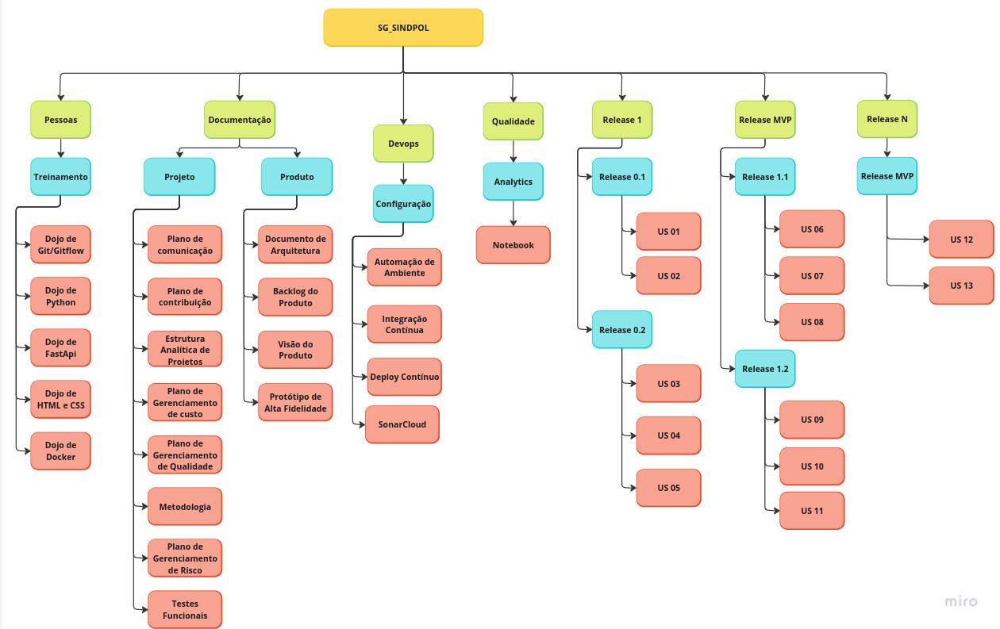

# Estrutura Analítica do Projeto

## 1. Introdução

A Estrutura Analítica do Projeto (EAP) é uma ferramenta que simplifica a organização de um projeto em uma hierarquia compreensível. Com a EAP, é viável subdividir os elementos entregáveis em subelementos menores, proporcionando uma visão mais clara do projeto e definindo suas interdependências principais.

A EAP adota um formato de árvore hierárquica, em que as atividades se tornam mais generalizadas no topo da estrutura e mais especificadas à medida que se desce. Essa estrutura tem como objetivo organizar tanto a fase de concepção do projeto e desenvolvimento do produto quanto os serviços necessários para o seu desenvolvimento.

## 2. Diagrama

## 3. Histórico de Revisão

| Data       | Versão | Modificação                     | Autor        |
| :--------- | :----- | :------------------------------ | :----------- |
| 19/10/2023 | 0.1    | Criação do documento.          | Mateus Maia |
| 20/10/2023 | 0.2    | Adição do diagrama  .          | Mateus Maia |
